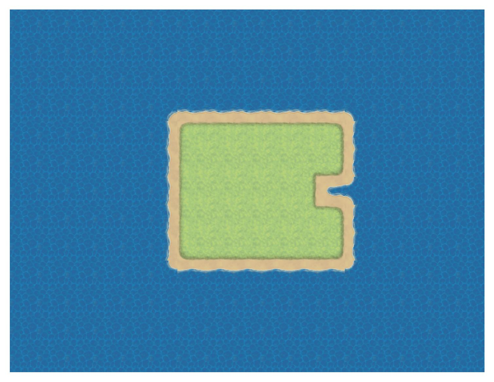

# Autotiles
It has been asked many times online about how the json data array works in RMMV, 
and how those tile ids result in the final map.
These online posts [1](https://forums.rpgmakerweb.com/index.php?threads/how-to-determine-your-tileid.91129/), 
[2](https://forums.rpgmakerweb.com/index.php?threads/autotile-tile-ids.2829/) 
give an excellent explanation.
Together with this [YouTube video](https://www.youtube.com/watch?v=nvdf6SM0N0k&t=463s) on creating customized autotile, 
you will be able to capture the gist of autotiles. 

## Demo
This is an [example](../examples/autotile_map_generation.py) showing how to generate map given predefined data array in json files. 

Here is [another example](../examples/floor_type_picture.py) how to plot those 48 variants (in different directions) of given autotile.

## Autotile tileset format
Each tile in RMMV is in shape 48 by 48, and the tileset is in shape 144 by 96. 
In fact, to compose different directions, the tile is divided into 4 tiny squares.
Each square is then in shape 24 by 24. 
So the tileset contains 24 squares: 

| 0 | 1 | 2 | 3 |
|---|---|---|---|
| 4 | 5 | 6 | 7 |
| 8  | 9 | 10 | 11 |
| 12 | 13 | 14 | 15 |
| 16 | 17 | 18 | 19 |
| 20 | 21 | 22 | 23 |

According to [post-2](https://forums.rpgmakerweb.com/index.php?threads/autotile-tile-ids.2829),
{13,14,17,18} is referred as center, {2,3,6,7} is outside corner (OC), 
and rest are inside corner (IC).
Each tile ID is associated with a (directional) variant of an autotile.

Since each tile ID tells an autotile, its shape will still be 48 by 48.
Then it must consist of 4 tiny squares out of those 24 possible squares.
We describe these 4 tiny squares by their locations in the tile, i.e., upper left (UL),
upper right (UR), lower left (LL) and lower right (LR).

| UL | UR |
|---|---|
| LL | LR |

There are 48 variants of an autotile, so they describe 48 different specifications of 
{UL, UR, LL, LR}. 
Thankfully, [post-2](https://forums.rpgmakerweb.com/index.php?threads/autotile-tile-ids.2829) gives 
all these specifications.  
